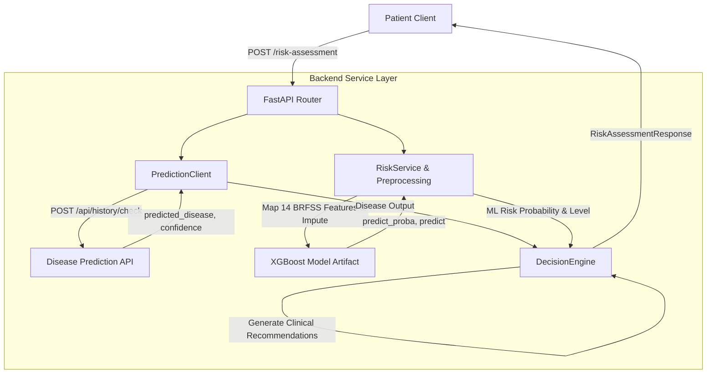

# MedAssist AI - Medical Symptom Analysis & Patient Risk Assessment System


Production-ready medical application backend providing patient health risk assessment and symptom analysis services.

---

## 🚀 Overview

**MedAssist AI** refactors patient risk evaluation into a modular, production-ready **Service-Based Architecture**. It integrates CDC BRFSS Machine Learning risk prediction with internal outputs from the Disease Prediction API (`POST /api/history/check`) through a clinical **Decision Layer**.

### Key Architectural Capabilities
- **Modular Service Layer**: Decoupled modules for external API communication (`PredictionClient`), feature preprocessing (`preprocessing.py`), ML risk inference (`risk_service.py`), and decision aggregation (`DecisionEngine`).
- **Resilient External Calls**: Graceful HTTP error handling and default fallbacks when external disease prediction services are unavailable or timeout.
- **CDC BRFSS ML Classifier**: Trained XGBoost model predicting patient risk categories based on 14 CDC BRFSS features.
- **Clinical Decision Layer**: Synthesizes baseline ML risk and disease prediction outputs to determine emergency alerts, severity grades, composite risk scores, and clinical recommendations.
- **Privacy & Schema Isolation**: Hides internal disease prediction metrics from the public API response schema to adhere strictly to requested data contracts.

---

## 📁 Repository Structure

```text
MedAssist AI/
├── backend/
│   ├── app/
│   │   ├── config/                     # Application settings & endpoints
│   │   │   ├── __init__.py
│   │   │   └── settings.py             # API URLs, timeouts, model artifact paths
│   │   ├── datasets/                   # CDC BRFSS 2024 datasets
│   │   ├── models/                     # Trained XGBoost ML artifacts (risk_model.pkl)
│   │   ├── routes/                     # FastAPI API routers
│   │   │   ├── health.py               # Health check endpoints (/health, /)
│   │   │   └── risk_assessment.py      # /risk-assessment endpoint router
│   │   ├── schemas/                    # Pydantic request & response models
│   │   │   ├── __init__.py
│   │   │   ├── patient.py              # RiskAssessmentRequest schema
│   │   │   └── response.py             # RiskAssessmentResponse schema
│   │   ├── services/                   # Modular service architecture
│   │   │   ├── __init__.py
│   │   │   ├── decision_engine.py      # Decision Layer combining ML + Disease outputs
│   │   │   ├── prediction_client.py    # Resilient HTTP client for Disease Prediction API
│   │   │   ├── preprocessing.py        # BRFSS feature mapping & artifact loader
│   │   │   └── risk_service.py         # XGBoost ML risk model inference
│   │   ├── utils/                      # Structured logging & utility modules
│   │   │   ├── __init__.py
│   │   │   └── logger.py
│   │   └── main.py                     # FastAPI app initialization & OpenAPI metadata
│   ├── scripts/                        # Automated ML model training & evaluation
│   │   └── train_risk_model.py
│   ├── tests/                          # Automated unit and integration test suite
│   │   └── test_risk_assessment.py
│   ├── RISK_ASSESSMENT_README.md       # Detailed Risk Assessment Module Documentation
│   └── requirements.txt                # Backend Python dependencies
└── README.md                           # Main Project Readme
```

---

## 🏗️ System Architecture & Data Flow



---

## ⚡ Quickstart & Verification

### 1. Install Dependencies
```bash
cd backend
pip install -r requirements.txt
```

### 2. Run Automated Test Suite
Runs all 11 unit & integration tests covering preprocessing, ML inference, API resilience, Decision Layer evaluation, and schema compliance:
```bash
cd backend
python -m unittest discover -s tests
```

### 3. Start Local Development Server
```bash
cd backend
python -m uvicorn app.main:app --reload --port 8000
```
Access Interactive Swagger Documentation: **[http://localhost:8000/docs](http://localhost:8000/docs)**

---

## 📡 Core API Summary

| Method | Endpoint | Description | Status Code |
| :--- | :--- | :--- | :--- |
| `GET` | `/` | Root endpoint sanity check | 200 OK |
| `GET` | `/health` | System health check endpoint | 200 OK |
| `POST` | `/risk-assessment` | Evaluates patient risk from BRFSS features & symptoms | 200 OK / 400 / 422 / 500 |

---

## 🧠 Model Training Pipeline

The patient risk classifier is trained on CDC BRFSS 2024 survey data using a composite multi-disease target (0=Low, 1=Medium, 2=High). Model performance is automatically evaluated between Random Forest and XGBoost based on Macro F1 score, saving the top artifact to `app/models/risk_model.pkl`.

To retrain the model:
```bash
cd backend
python scripts/train_risk_model.py
```

---

## 📚 Detailed Documentation

For full architectural details, service responsibilities, decision rules, and API schemas, see the [Risk Assessment Module Readme](backend/RISK_ASSESSMENT_README.md).
