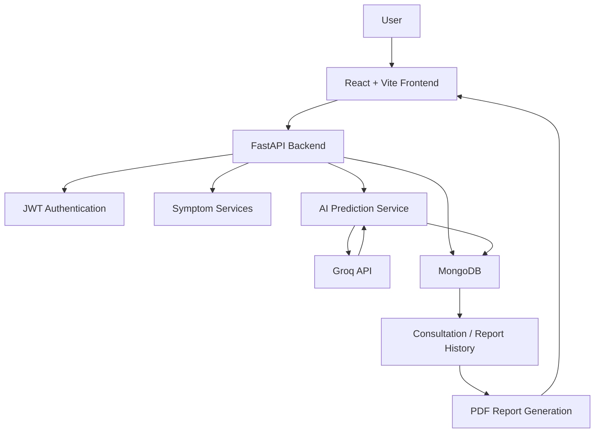

# 🩺 MedAssist AI

> An AI-powered healthcare assistance platform for symptom analysis, health insights, consultation history, and downloadable medical reports.

MedAssist AI is a full-stack healthcare assistance web application designed to help users understand their reported symptoms through an AI-powered analysis workflow.

Users can securely create an account, select symptoms from categorized medical symptoms, submit them for AI analysis, view prediction results with confidence and risk information, receive recommendations and precautions, maintain consultation history, and download generated reports as PDF documents.

> ⚕️ **Medical Disclaimer:** MedAssist AI is intended for informational and educational purposes only. AI-generated predictions and recommendations should not be considered a substitute for professional medical diagnosis, treatment, or emergency medical care. Always consult a qualified healthcare professional for medical decisions.

---

## 🌐 Live Application

### Frontend
https://medassist-ai-frontend.onrender.com

### Backend API
https://medassistai-unpq.onrender.com

### API Documentation
https://medassistai-unpq.onrender.com/docs

The API documentation is available through FastAPI Swagger UI.

---

## ✨ Key Features

### 🔐 Secure Authentication

- User registration and login
- JWT-based authentication
- Protected API endpoints
- User-specific consultation and report access
- Password hashing and secure credential handling

### 🏠 Interactive Dashboard

The dashboard provides users with a centralized interface for accessing the major features of MedAssist AI, including symptom analysis and health-related information.

### 🩺 AI-Powered Symptom Checker

Users can:

- Browse available symptoms
- Search symptoms
- Select multiple symptoms
- View symptoms according to medical categories
- Submit selected symptoms for AI analysis

### 🗂️ Medical Symptom Categories

The application organizes symptoms into categories including:

- General
- Cardiology
- Pulmonology
- Dermatology
- Gastroenterology
- ENT
- Pain & Discomfort
- Mental Health
- Gynecology
- Musculoskeletal
- Ophthalmology
- Urology

The current symptom catalog contains **377 symptoms**.

### 🤖 AI Disease Prediction

Selected symptoms are processed by the backend and analyzed using the Groq API.

The current AI model used by the application is:

**`openai/gpt-oss-120b`**

The AI analysis can provide:

- Predicted condition
- Confidence level
- Risk level
- Reasoning/explanation
- Recommendations
- Suggested tests
- Precautions
- Guidance on when to consult a doctor
- Selected symptoms

### 📊 Prediction Results

After analysis, users can view the generated prediction and supporting information through a dedicated results interface.

### 📁 Consultation & Report History

AI analysis results are stored as user-specific consultation records, allowing users to access their previous reports.

### 📄 PDF Report Generation

Users can generate and download a PDF report containing the relevant consultation and AI analysis information.

### 🔌 REST API

The backend exposes RESTful API endpoints through FastAPI for:

- Authentication
- User profiles
- Symptoms
- AI predictions
- Consultation history
- Reports

Interactive API documentation is available through Swagger UI.

---

# 🏗️ System Architecture



### Application Workflow

```text
User
  ↓
Register / Login
  ↓
Dashboard
  ↓
Symptom Checker
  ↓
Select Symptoms
  ↓
Submit for AI Analysis
  ↓
FastAPI Backend
  ↓
Groq AI Model
  ↓
Prediction & Recommendations
  ↓
Store Consultation
  ↓
View Report
  ↓
Download PDF
```

---

# 🧰 Technology Stack

| Layer | Technology | Purpose |
|---|---|---|
| Frontend | React | User interface |
| Frontend Build Tool | Vite | Development and production build |
| Frontend Routing | React Router | Client-side navigation |
| Styling | CSS | Application styling |
| Backend | Python | Server-side development |
| Backend Framework | FastAPI | REST API development |
| Server | Uvicorn | ASGI application server |
| Authentication | JWT | User authentication and authorization |
| Database | MongoDB | Persistent application data |
| MongoDB Driver | Motor / PyMongo | Database communication |
| AI | Groq API | AI-powered symptom analysis |
| AI Model | `openai/gpt-oss-120b` | AI prediction generation |
| PDF Generation | ReportLab | Medical report generation |
| Deployment | Render | Cloud deployment |

---

# 📂 Project Structure

```text
MedAssistAI/
│
├── backend/
│   ├── app/
│   │   ├── api/
│   │   │   ├── endpoints/
│   │   │   └── router.py
│   │   ├── core/
│   │   ├── models/
│   │   ├── schemas/
│   │   ├── services/
│   │   └── main.py
│   ├── scripts/
│   ├── tests/
│   └── requirements.txt
│
├── medassist-ai-frontend/
│   ├── src/
│   │   ├── components/
│   │   ├── pages/
│   │   ├── services/
│   │   └── utils/
│   ├── public/
│   ├── package.json
│   └── vite.config.*
│
├── screenshots/
└── README.md
```

> The exact folder structure may evolve as development continues.

---

# 🔌 Backend API

The MedAssist AI backend is implemented using FastAPI.

## Health Check

```http
GET /
```

Returns the backend health/status information.

## Authentication

Authentication endpoints provide user registration and login functionality.

## Symptoms

```http
GET /api/symptoms
```

Retrieves the available symptom catalog.

```http
GET /api/symptoms/search
```

Searches the symptom catalog.

```http
GET /api/symptoms/categories
```

Retrieves the available symptom categories.

## AI Prediction

```http
POST /api/predictions/analyze
```

Submits selected symptoms for AI analysis.

## Prediction Retrieval

```http
GET /api/predictions/{prediction_id}
```

Retrieves a specific prediction for the authenticated user.

## Reports

```http
GET /api/reports
```

Retrieves the authenticated user's consultation reports.

```http
GET /api/reports/{report_id}/download
```

Generates/downloads a PDF report.

```http
DELETE /api/reports/{report_id}
```

Deletes a report.

### Swagger Documentation

https://medassistai-unpq.onrender.com/docs

---

# 🗄️ Database

MedAssist AI uses **MongoDB** for persistent application data.

The application uses collections including:

| Collection | Purpose |
|---|---|
| `users` | User authentication and account information |
| `profiles` | User profile information |
| `symptoms` | Indexed symptom catalog |
| `disease_profiles` | Disease and symptom relationship information |
| `consultations` | User-specific prediction and consultation records |

The symptom catalog currently contains **377 indexed symptoms**.

---

# 🤖 AI Integration

The AI prediction workflow is implemented in the backend.

### Workflow

```text
Selected Symptoms
       ↓
Frontend API Request
       ↓
FastAPI Prediction Endpoint
       ↓
AI Prediction Service
       ↓
Groq API
       ↓
openai/gpt-oss-120b
       ↓
Structured JSON Response
       ↓
Consultation Storage
       ↓
Frontend Prediction Result
```

The AI service processes the selected symptoms and requests a structured response containing prediction-related information.

The backend then adds the selected symptoms to the returned result and stores the consultation information for the authenticated user.

### Important

The AI output is **not a clinically validated diagnosis**.

It is intended to provide general informational assistance and should not replace professional medical evaluation.

---

# 🔐 Security

The application includes several security mechanisms:

- JWT-based authentication
- Protected backend endpoints
- Password hashing
- User-specific report access
- Environment-based configuration for secrets
- Production CORS configuration
- HTTPS-based deployment

### Environment Variables

Sensitive configuration values must be stored using environment variables.

Example:

```env
MONGODB_URL=<your-mongodb-connection-string>
JWT_SECRET_KEY=<your-secret-key>
GROQ_API_KEY=<your-groq-api-key>
```

> Never commit `.env` files, API keys, database credentials, passwords, or JWT secrets to GitHub.

---

# 🚀 Deployment

MedAssist AI is deployed as a full-stack application.

## Frontend

Hosted on Render:

https://medassist-ai-frontend.onrender.com

## Backend

Hosted on Render:

https://medassistai-unpq.onrender.com

## API Documentation

FastAPI Swagger documentation:

https://medassistai-unpq.onrender.com/docs

The deployed frontend communicates with the deployed FastAPI backend through HTTPS APIs.

---

# 🧪 Testing & Validation

The application was tested across the major user workflow.

| Test Area | Expected Result |
|---|---|
| User Registration | User account is created successfully |
| User Login | User receives authenticated session/token |
| Dashboard | Dashboard loads for authenticated user |
| Symptom Catalog | Symptoms are retrieved from backend |
| Symptom Search | Matching symptoms can be searched |
| Category Filtering | Symptoms are displayed according to category |
| AI Analysis | Selected symptoms are processed by AI |
| Prediction Result | AI-generated result is displayed |
| Consultation Storage | Prediction is stored for the user |
| Reports | Previous consultations can be viewed |
| PDF Download | Report can be downloaded as PDF |
| API Documentation | Swagger UI is accessible |

---

# 🛠️ Important Development Issues Resolved

During development and deployment, several integration issues were identified and resolved.

### CORS Configuration

The deployed frontend and backend required correct production CORS configuration.

The backend was configured to allow requests from the deployed frontend origin.

### AI Model Availability

The initially configured Groq model was no longer available for the API account.

The available model was verified through the Groq model API and the application was updated to use:

```text
openai/gpt-oss-120b
```

### MongoDB ObjectId Serialization

MongoDB automatically adds an `_id` field containing an ObjectId.

The API response handling was updated to remove the MongoDB ObjectId before returning JSON responses where necessary.

### Report Retrieval

The report download functionality was updated to retrieve reports through the MongoDB collection rather than relying on an incompatible local data representation.

### Production Integration

The frontend and backend were tested together after deployment to ensure authentication, symptom retrieval, AI analysis, consultation storage, and report functionality worked correctly.

---

# 🖥️ Application Screenshots

> Store screenshots inside the `screenshots/` directory of the repository.

## Login/Register


User authentication interface.

## Dashboard


Main dashboard providing access to the application's healthcare assistance features.

## Symptom Checker


Interface for searching and selecting symptoms.

## Medical Categories


Category-based symptom organization.

## AI Prediction


AI-generated prediction and supporting information.

## Reports


User consultation and report history.

## PDF Report


Generated medical report available for download.

## API Documentation


FastAPI Swagger API documentation.


---

# ⚙️ Local Development

## Prerequisites

Make sure the following are installed:

- Python
- Node.js
- npm
- MongoDB or MongoDB Atlas
- Groq API account/API key

## Clone the Repository

```bash
git clone https://github.com/GKSJ-AI-CliniScan/MedAssistAI.git
cd MedAssistAI
```

## Backend Setup

Navigate to the backend:

```bash
cd backend
```

Create a virtual environment:

```powershell
python -m venv venv
```

### Windows

```powershell
venv\Scripts\activate
```

### Install Dependencies

```bash
pip install -r requirements.txt
```

Create a `.env` file and configure the required environment variables:

```env
PROJECT_NAME=MedAssist AI Backend
DEBUG=true
MONGODB_URL=<your-mongodb-url>
JWT_SECRET_KEY=<your-secret-key>
GROQ_API_KEY=<your-groq-api-key>
```

Start the backend:

```bash
uvicorn app.main:app --reload
```

Backend:

```text
http://localhost:8000
```

Swagger:

```text
http://localhost:8000/docs
```

---

# 💻 Frontend Setup

Navigate to the frontend:

```bash
cd medassist-ai-frontend
```

Install dependencies:

```bash
npm install
```

Start the development server:

```bash
npm run dev
```

The Vite development server will provide the local frontend URL in the terminal.

---

# 🔮 Future Enhancements

Potential future improvements include:

- 🌐 Multilingual healthcare assistance
- 👨‍⚕️ Doctor consultation integration
- 📱 Dedicated mobile application
- 🧠 Improved medical knowledge grounding
- 📊 Advanced health analytics
- 🔔 Health-related notifications and reminders
- 🛡️ Additional clinical safety mechanisms
- 📈 Improved prediction validation and evaluation
- 🗣️ Voice-based symptom input

These are future enhancements and are not represented as currently implemented features.

---

# ⚠️ Limitations

- AI-generated results may not always be medically accurate.
- The application does not replace professional medical diagnosis or treatment.
- AI analysis depends on the availability of the external AI API.
- Internet connectivity is required for cloud-based AI processing.
- Free-tier cloud hosting may introduce startup/cold-start delays.
- Medical decisions should always be made in consultation with qualified healthcare professionals.

---

# 👥 Team

MedAssist AI is developed by a multidisciplinary team covering machine learning, frontend development, backend engineering, database architecture, data visualization, and cloud deployment.

| Team Member | Role | Responsibilities |
|---|---|---|
| **VINAYAK A S** | ML Engineer 1 & Data Analyst | Core disease prediction model and data merging |
| **SK DAIMEL BASITH** | Frontend Developer & Cloud Engineer | UI components, Docker, and AWS/Azure deployment |
| **AKANKSHA M** | Frontend Developer & Data Visualizer | Core UI development, symptom forms, and Chart.js |
| **ANBARASAN K** | Backend Developer & Database Architect | MongoDB, user authentication, and patient history logic |
| **HEMASRI K** | ML Engineer 2 & Backend Developer | Risk assessment model and Python API development |

### Team Responsibilities

- **Machine Learning & Data:** Disease prediction, risk assessment, dataset processing, and data merging.
- **Frontend Development:** User interface, symptom selection forms, dashboards, and data visualization.
- **Backend Development:** REST APIs, authentication, business logic, and AI integration.
- **Database Architecture:** MongoDB integration, user data, symptoms, and patient consultation history.
- **Cloud & Deployment:** Application deployment, containerization, and cloud infrastructure.

# 📄 License

License information has not yet been specified for this repository.

---

# 🔗 Quick Links

| Resource | Link |
|---|---|
| 🌐 Live Application | https://medassist-ai-frontend.onrender.com |
| ⚙️ Backend | https://medassistai-unpq.onrender.com |
| 📚 API Documentation | https://medassistai-unpq.onrender.com/docs |

---

# ⚕️ Medical Disclaimer

**MedAssist AI is an AI-assisted healthcare information system intended for informational and educational purposes only.**

AI-generated predictions, recommendations, risk information, and other outputs should not be considered a substitute for professional medical diagnosis, treatment, or emergency care.

If you are experiencing serious or emergency symptoms, seek immediate medical attention from an appropriate healthcare professional or emergency service.

---

## ⭐ Project Status

**Status: Deployed and Functional**

MedAssist AI currently provides an end-to-end workflow from authenticated symptom selection through AI-assisted analysis, consultation storage, report viewing, and PDF report generation.
