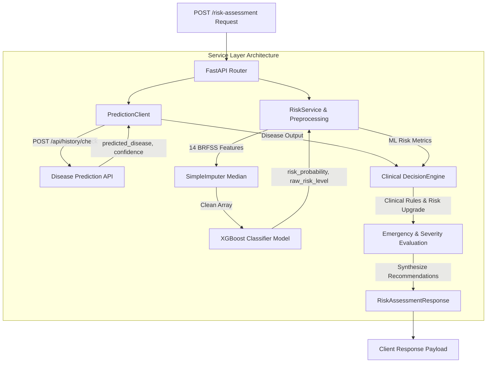

# Risk Assessment Module - MedAssist AI

Production-ready FastAPI Risk Assessment module for the **MedAssist AI** Medical Symptom Analysis & Patient Health Risk Assessment System.

This module evaluates patient health risk using a **modular, service-based architecture**. It combines an **XGBoost Classifier Machine Learning model** (trained on 14 CDC BRFSS features) with internal outputs from the **Disease Prediction API** (`POST /api/history/check`) through a dedicated **Clinical Decision Layer**.

---

## 📁 Module Directory Structure

```text
backend/
├── app/
│   ├── config/                         # System Configuration & Settings
│   │   ├── __init__.py
│   │   └── settings.py                 # API URLs, timeouts, model artifact paths
│   │
│   ├── datasets/                       # Training & Processed Datasets
│   │   ├── BRFSS2024.csv               # CDC BRFSS 2024 primary dataset (~422MB)
│   │   └── BRFSS2024_Cleaned.csv       # Preprocessed dataset generated during training
│   │
│   ├── models/                         # Trained ML Artifacts
│   │   └── risk_model.pkl              # Saved XGBoost ML model payload
│   │
│   ├── routes/                         # API Endpoints & FastAPI Routers
│   │   ├── health.py                   # Health check router (/health, /)
│   │   └── risk_assessment.py          # /risk-assessment endpoint router
│   │
│   ├── schemas/                        # Pydantic Schemas & Data Validation
│   │   ├── __init__.py
│   │   ├── patient.py                  # RiskAssessmentRequest (14 BRFSS features + symptoms)
│   │   └── response.py                 # RiskAssessmentResponse (strict public API output)
│   │
│   ├── services/                       # Modular Service Architecture
│   │   ├── __init__.py
│   │   ├── decision_engine.py          # Decision Layer combining ML + Disease outputs
│   │   ├── prediction_client.py        # Resilient HTTP client for Disease Prediction API
│   │   ├── preprocessing.py            # BRFSS feature mapping & artifact loader
│   │   └── risk_service.py             # XGBoost ML risk model inference
│   │
│   ├── utils/                          # Logging & Utilities
│   │   ├── __init__.py
│   │   └── logger.py                   # Structured logger setup
│   │
│   └── main.py                         # FastAPI App Initialization & OpenAPI metadata
│
├── scripts/
│   └── train_risk_model.py             # Automated ML training & model comparison script
│
└── tests/
    └── test_risk_assessment.py         # Comprehensive unit & integration test suite
```

---

## ⚙️ Service-Based Architecture & Workflow



### Core Module Responsibilities

1. **`prediction_client.py` (`PredictionClient`)**:
   - Sends patient symptoms to `POST /api/history/check`.
   - Extracts `predicted_disease` and `prediction_confidence`.
   - Gracefully handles missing symptoms, network timeouts (`5.0s`), and HTTP errors by returning default fallbacks `("Unknown", 0.0)`.

2. **`preprocessing.py`**:
   - Loads and caches the `risk_model.pkl` artifact containing model, median imputer, feature columns, and target labels.
   - Maps 14 patient-friendly request fields into exact CDC BRFSS column names:
     - `_AGE80` (Age in years)
     - `_SEX` (Sex: 1=Male, 0=Female)
     - `_BMI5` (Body Mass Index)
     - `GENHLTH` (General health status: 1=Excellent to 5=Poor)
     - `PHYSHLTH` (Physical health days not good)
     - `MENTHLTH` (Mental health days not good)
     - `EXERANY2` (Physical activity in past 30 days)
     - `SMOKE100` (Smoked 100+ cigarettes)
     - `DRNKANY6` (Alcohol consumption past 30 days)
     - `DIABETE4` (Diabetes diagnosis)
     - `CHCKDNY2` (Kidney disease diagnosis)
     - `ASTHMA3` (Asthma diagnosis)
     - `CHCCOPD3` (COPD / Chronic bronchitis diagnosis)
     - `HAVARTH4` (Arthritis diagnosis)
   - Performs median missing value imputation on incoming features.

3. **`risk_service.py` (`calculate_ml_risk`)**:
   - Executes `model.predict_proba()` and `model.predict()` on the preprocessed feature vector.
   - Calculates baseline ML `risk_probability` (0.0 to 1.0) and assigns initial `raw_risk_level` ('Low', 'Medium', 'High').

4. **`decision_engine.py` (`DecisionEngine`)**:
   - Combines baseline ML risk metrics with internal disease prediction outputs without altering raw ML `risk_probability`.
   - Performs defensive parameter casting for input values with default fallbacks.
   - Executes flexible **substring keyword matching** against critical conditions (heart attack, stroke, sepsis, pulmonary embolism, cardiac arrest, aortic dissection, etc.).
   - **Personalized Risk Level Upgrade Rules**:
     - Upgrades `Medium` or `Low` to `High` if a critical disease is identified with high confidence ($\ge 0.80$).
     - Upgrades `Low` to `Medium` if disease confidence $\ge 0.90$ and patient ML risk probability $\ge 0.30$.
   - **Emergency Alert Triggers**:
     - Critical disease present with high confidence ($\ge 0.80$) and final risk level is `High`.
     - Baseline patient ML risk probability is exceptionally high ($\ge 0.90$).
   - **Severity Grading**: Maps evaluation outcome to `Critical`, `Severe`, `Moderate`, or `Mild`.
   - **Recommendation Engine**: Synthesizes general clinical action steps combined with **condition-specific advice** (e.g. blood pressure monitoring for hypertension, glycemic control for diabetes, respiratory symptom tracking for asthma).

---

## 📡 API Specification

### `POST /risk-assessment`

Evaluates comprehensive patient health risk. Accepts patient symptoms and 14 CDC BRFSS features, and returns the final clinical risk payload.

#### Request Schema (`RiskAssessmentRequest`)

| Field | Type | Range / Constraints | Description |
| :--- | :--- | :--- | :--- |
| `age` | `int` | $0 \le age \le 120$ | Patient's age in years. |
| `gender` | `int` | `0` or `1` | Biological sex ($1=\text{Male}, 0=\text{Female}$). |
| `bmi` | `float` | $10.0 \le bmi \le 100.0$ | Body Mass Index ($\text{kg/m}^2$). |
| `general_health` | `int` | $1 \le general\_health \le 5$ | Health status ($1=\text{Excellent}, 2=\text{Very Good}, 3=\text{Good}, 4=\text{Fair}, 5=\text{Poor}$). |
| `exercise` | `int` | `0` or `1` | Physical activity in past 30 days ($1=\text{Yes}, 0=\text{No}$). |
| `smoking` | `int` | `0` or `1` | Smoked 100+ cigarettes in lifetime ($1=\text{Yes}, 0=\text{No}$). |
| `alcohol` | `int` | `0` or `1` | Alcohol consumption in past 30 days ($1=\text{Yes}, 0=\text{No}$). |
| `diabetes` | `int` | `0` or `1` | Ever diagnosed with diabetes ($1=\text{Yes}, 0=\text{No}$). |
| `arthritis` | `int` | `0` or `1` | Ever diagnosed with arthritis ($1=\text{Yes}, 0=\text{No}$). |
| `asthma` | `int` | `0` or `1` | Ever diagnosed with asthma ($1=\text{Yes}, 0=\text{No}$). |
| `copd` | `int` | `0` or `1` | Ever diagnosed with COPD ($1=\text{Yes}, 0=\text{No}$). |
| `kidney_disease` | `int` | `0` or `1` | Ever diagnosed with kidney disease ($1=\text{Yes}, 0=\text{No}$). |
| `mental_health` | `int` | $0 \le mental\_health \le 30$ | Days mental health was not good in past 30 days. |
| `physical_health`| `int` | $0 \le physical\_health \le 30$| Days physical health was not good in past 30 days. |
| `symptoms` | `List[str]`| List of strings | Patient-reported symptoms for disease prediction. |

#### Request Payload Example

```json
{
  "age": 65,
  "gender": 1,
  "bmi": 28.5,
  "general_health": 3,
  "exercise": 1,
  "smoking": 0,
  "alcohol": 1,
  "diabetes": 1,
  "arthritis": 1,
  "asthma": 0,
  "copd": 0,
  "kidney_disease": 0,
  "mental_health": 2,
  "physical_health": 5,
  "symptoms": ["chest_pain", "shortness_of_breath"]
}
```

#### Response Schema (`RiskAssessmentResponse`)

```json
{
  "risk_probability": 0.87,
  "risk_score": 87,
  "risk_level": "High",
  "severity": "Severe",
  "emergency_alert": true,
  "recommendations": [
    "Urgent medical evaluation is recommended. Seek emergency care if severe or rapidly worsening symptoms are present.",
    "Prompt consultation with a healthcare professional is recommended for further evaluation.",
    "Discuss cardiovascular symptoms and risk factors with a healthcare professional."
  ]
}
```

*Note: Internal disease prediction fields (`predicted_disease` and `prediction_confidence`) are processed strictly inside the Decision Layer and are **not** exposed in the public API response.*

---

## 🧠 Machine Learning Model Training & Evaluation

The ML pipeline script (`scripts/train_risk_model.py`) trains and evaluates machine learning classifiers on the CDC BRFSS 2024 dataset.

### Target Variable Construction (`Risk_Level`)
Built using a composite multi-disease score from 7 chronic indicators (`DIABETE4`, `CVDINFR4`, `CVDCRHD4`, `CVDSTRK3`, `CHCKDNY2`, `CHCCOPD3`, `ASTHMA3`):
- **High Risk (`2`)**: Major cardiovascular event (heart attack, stroke, angina) OR $\ge 2$ chronic conditions.
- **Medium Risk (`1`)**: Exactly 1 chronic condition.
- **Low Risk (`0`)**: 0 chronic conditions.

### Model Benchmarking & Selection
1. **Random Forest Classifier**: `n_estimators=150`, `max_depth=12`, `class_weight='balanced'`.
2. **XGBoost Classifier**: `n_estimators=150`, `max_depth=6`, `learning_rate=0.1`.

The script automatically selects the model with the higher **Macro F1 Score** and saves the full artifact dictionary (`model`, `imputer`, `feature_cols`, `target_labels`, `metrics`) to `app/models/risk_model.pkl`.

---

## 🧪 Testing & Verification Guide

### Method 1: Run Automated Unit & Integration Tests
Executes the full test suite in `tests/test_risk_assessment.py`:
```bash
cd backend
python -m unittest discover -s tests
```

### Method 2: Start Development Server & Interactive OpenAPI Docs
1. Launch uvicorn dev server:
   ```bash
   cd backend
   python -m uvicorn app.main:app --reload --port 8000
   ```
2. Open Swagger UI in browser: **[http://localhost:8000/docs](http://localhost:8000/docs)**
3. Select `POST /risk-assessment`, click **Try it out**, paste test payload, and click **Execute**.

### Method 3: Test via PowerShell / cURL
With the server running on `localhost:8000`:

```powershell
Invoke-RestMethod -Uri "http://localhost:8000/risk-assessment" -Method Post -ContentType "application/json" -Body '{
  "age": 65,
  "gender": 1,
  "bmi": 28.5,
  "general_health": 3,
  "exercise": 1,
  "smoking": 0,
  "alcohol": 1,
  "diabetes": 1,
  "arthritis": 1,
  "asthma": 0,
  "copd": 0,
  "kidney_disease": 0,
  "mental_health": 2,
  "physical_health": 5,
  "symptoms": ["chest_pain", "shortness_of_breath"]
}'
```
